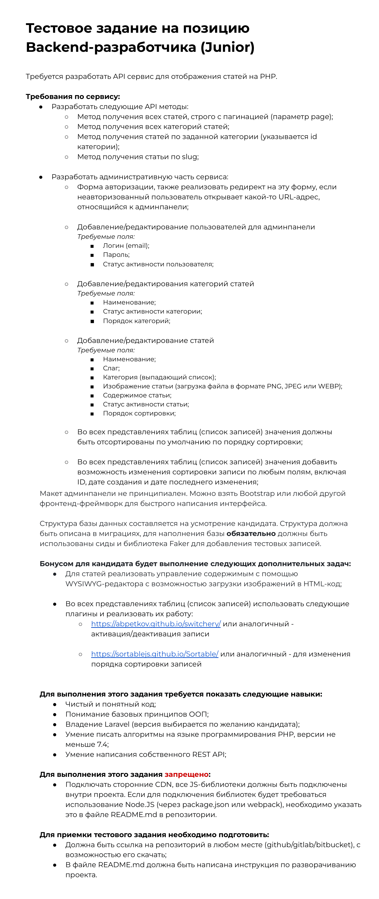
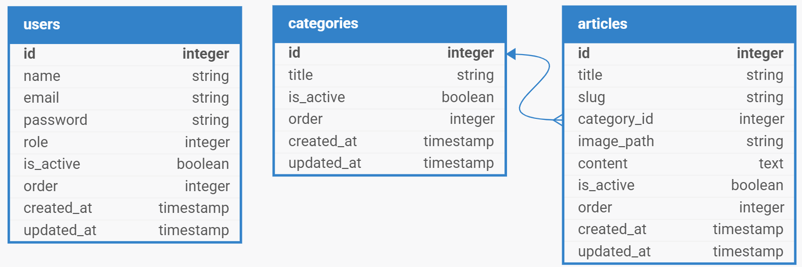
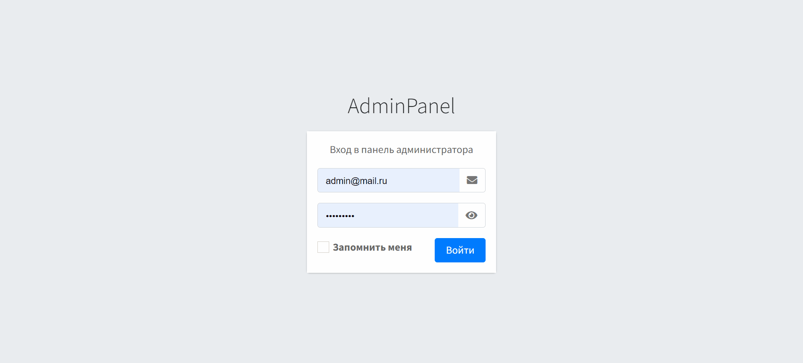
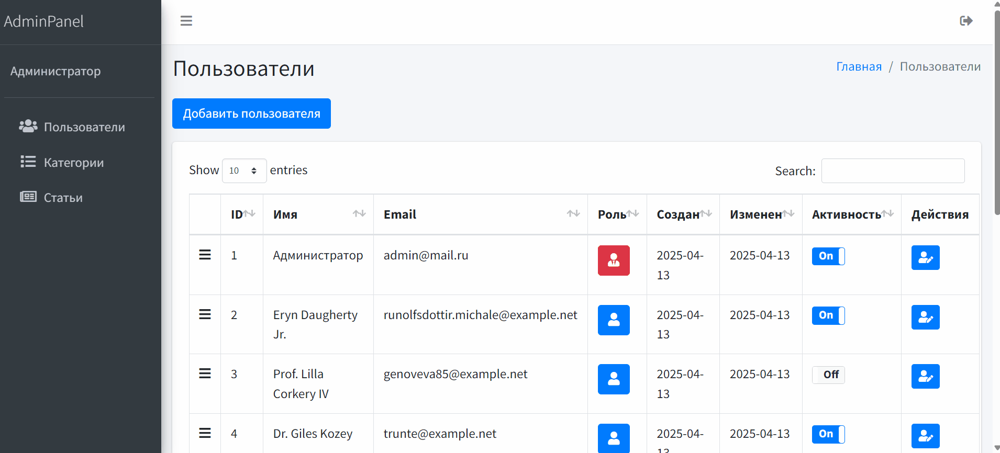
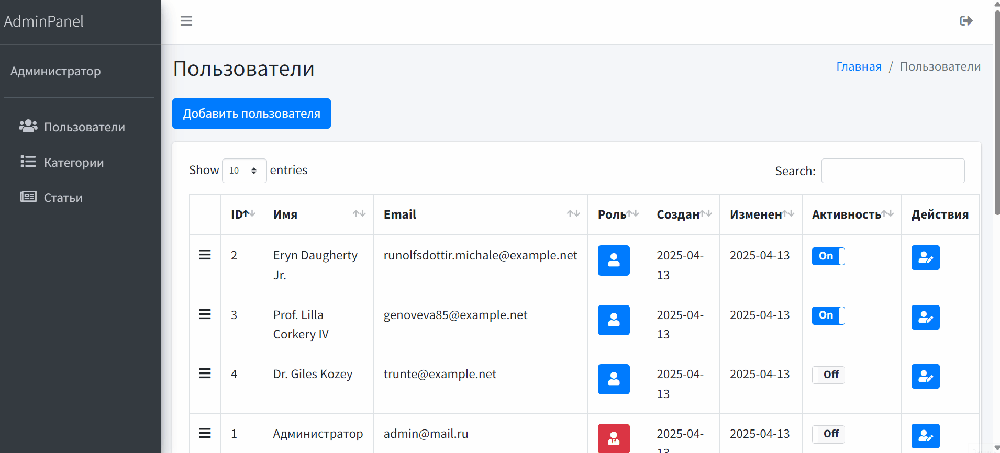
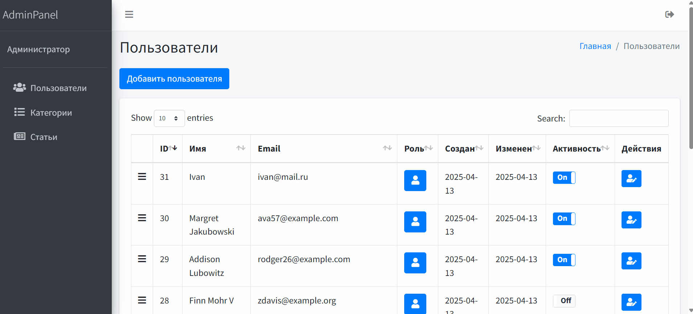
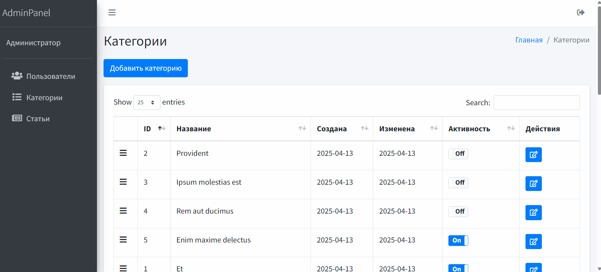
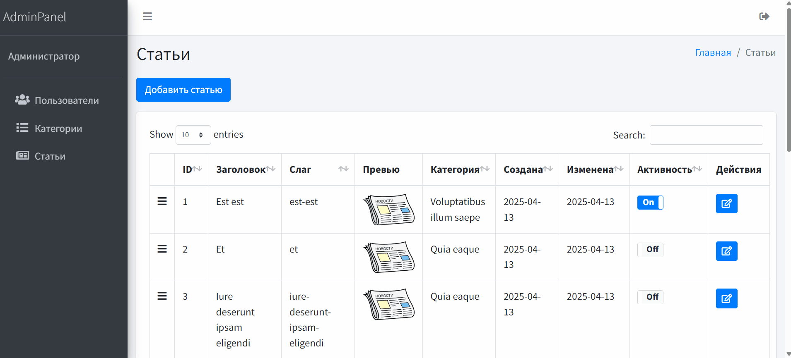
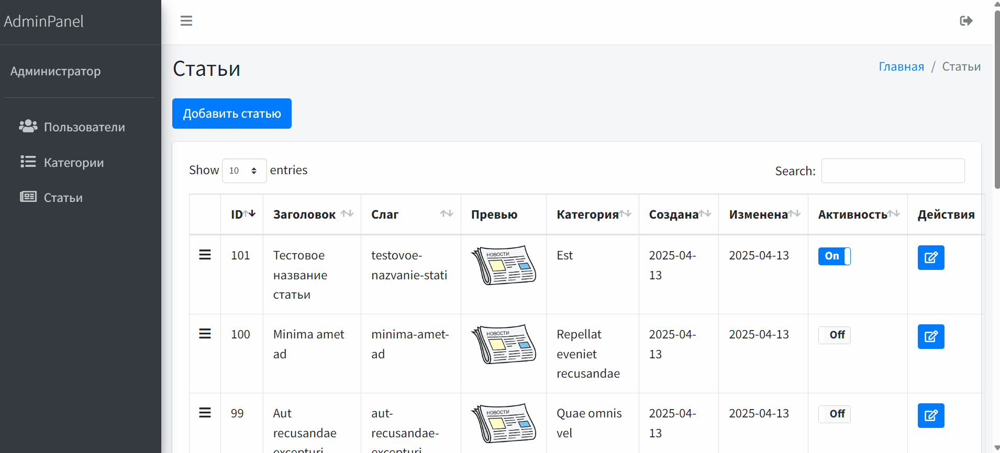

# Содержание 

📚 [Описание проекта](#описание-проекта)

📚 [Инструкция по установке](#инструкция-по-установке)

📚 [Использованные технологии](#использованные-технологии)

📚 [Структура базы данных](#структура-базы-данных)

📚 [Методы API](#методы-api)

📚 [Обзор админ панели](#обзор-админ-панели)

# Описание проекта

<details>
<summary>В данном проекте реализуется Тестовое задание на позицию Backend-разработчика (Junior)</summary>


</details>


# Инструкция по установке

🔹Клонируйте репозиторий
```
git clone git@github.com:nikolayB9/test_task_2.git
cd test_task_2
```

🔹Установите зависимости Laravel (через Composer)
```
composer install
```

🔹Скопируйте .env-файл и сгенерируйте ключ приложения
```
cp .env.example .env
php artisan key:generate
```

🔹В папке `database/` создайте файл `database.sqlite`

🔹Задайте соединение с базой данных в `.env`
```
DB_CONNECTION=sqlite
DB_DATABASE=/абсолютный/путь/к/database/database.sqlite
```

🔹Выполните миграции и заполните базу тестовыми данными
```
php artisan migrate --seed
```

🔹Создайте символическую ссылку для публичного доступа к файлам
```
php artisan storage:link
```

🔹Запустите локальный сервер Laravel
```
php artisan serve
```

🔹Установка и запуск frontend (Node.js) в **новой консоли**
```
npm install
npm run dev
```

🔹Откройте сайт в браузере по адресу

<a href="http://localhost:8000">http://localhost:8000</a>

🔹Введите логин и пароль
```
admin@mail.ru

123123123
```


# Использованные технологии

🔹 **Laravel** — фреймворк, версия 12.0  
🔹 **PHP** — версия 8.2  
🔹 **SQLite** — база данных  
🔹 **Blade** — шаблонизатор Laravel  
🔹 **AdminLTE** — панель администратора, версия 3.2.0  
🔹 **Summernote** — WYSIWYG-редактор  
🔹 **Bootstrap 4 Toggle** — плагин-переключатель  
🔹 **Sortable** — плагин сортировки


# Структура базы данных




# Методы API

### 🔹 Получение всех категорий
**GET** `/api/v1/categories`

---

### 🔹 Получение всех статей с пагинацией
**GET** `/api/v1/articles`  

Параметры запроса:
- `page` — номер страницы (по умолчанию = 1)
- `per_page` — количество элементов на страницу (по умолчанию = 15)

---

### 🔹 Получение статей по ID категории с пагинацией
**GET** `/api/v1/articles/category/{category}`  

Параметры запроса:
- `page` — номер страницы (по умолчанию = 1)
- `per_page` — количество элементов на страницу (по умолчанию = 15)

---

### 🔹 Получение статьи по slug
**GET** `/api/v1/articles/{slug}`


# Обзор админ панели

### 🔹 Главная

- Авторизация, главная страница:


---

### 🔹 Пользователи

- Основная таблица: 
  
  <br>
- Добавление пользователя:
  
  <br>
- Редактирование пользователя:


---

### 🔹 Категории

- Основная таблица:
    
<br>
- Добавление, редактирование категорий:
  

---

### 🔹 Статьи

- Основная таблица:
   
<br>
- Добавление статьи:
           
<br>
- Редактирование статьи:

